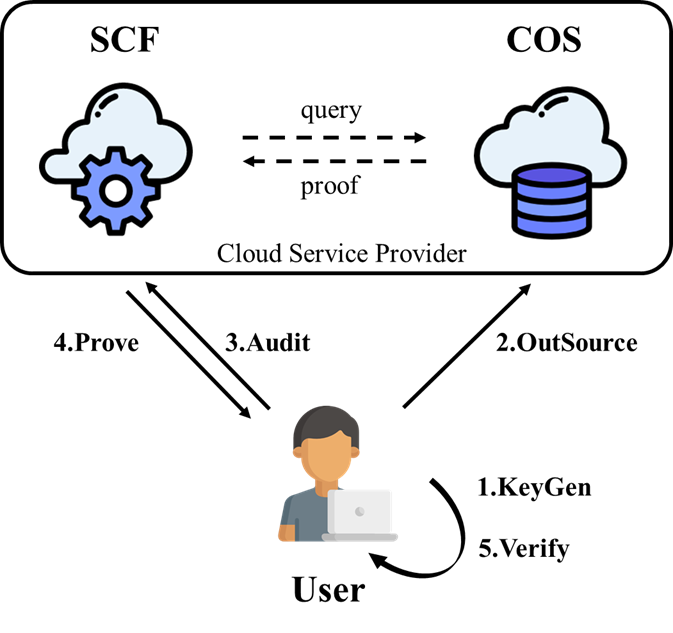

# Cloud Storage Auditing System Using Serverless Computing

Cloud storage auditing research is dedicated to solving the data integrity problem of outsourced storage on the cloud. In re-
cent years, researchers have proposed various cloud storage auditing schemes using different techniques. While these work are elegant in theory, they assume an ideal cloud storage model, i.e., the cloud provides the storage and compute interfaces as required by the proposed schemes. However, this does not hold for mainstream cloud storage system because these systems only provide read and write interfaces,but not compute interface. To bridge this gap, this work proposes a serverless computing-based cloud storage auditing system for existing mainstream cloud object storage. The proposed system leverages exiting cloud storage auditing schemes as a basic building block. Leveraging the characteristics of serverless computing, the proposed system realizes economical, pay-as-you-go cloud storage auditing. The proposed system also supports mainstream cloud storage upper layer applications (e.g., file preview) by not modifying the data formats when embedding authentication tags for latter auditing. Experimental results show that the
proposed scheme is efficient and promising for practical usage.

To better reveal the possibility of cloud storage auditing protocols becoming practical, we also designed a cost model to portray the economic performance. For more technical background and details, please refer to our [manuscript](xx), which is currently being submitted.



In the implementation, we also provide a [python script](xxx) to compute the challenge length `l` that is used by PDP scheme.

## Build

We use java 1.8.0_202, tencentcloud-sdk-java 3.1.210  to develop this project and use IntelliJ IDEA and Maven to compile it. For more configuration details, please refer to [pom.xml](xx).

Please note that when packaging serverless cloud functions, you need to modify the <build> configuration in pom.xml. 


## Usage

Firstly, please import this project into IntelliJ IDEA and it will automatically import all dependencies in pom.xml.

Secondly, you have to prepare the cloud-object-storage service and serverless cloud-function service in the Tencent Cloud or other  cloud service provider.

Upload the packaged jar file to the serverless cloud function, select the API gateway as the trigger and configure accordingly.
For the details of the configuration and use of cloud services, please refer to the [Tencent Cloud documentation](https://intl.cloud.tencent.com/document/product) or the instructions of the cloud service provider you use.

Thus, we have prepared the basis for the operation of the system.

You can start the audit system in IDEA as follows:

1. Replace the string "filePath" with your destination directory which stores the data that is to be outsourced.
2. Prepare the string "cosConfigFilePath" which provide the COS configuration, including secretId, ecretKey, regionName, bucketName.
3. Prepare the string "reqPath" which provide the request link to trigger the execution of the cloud function.
4. Locate the class “com.fchen_group.TPDSInScf.Run.Benchmark”,  which is the entrance of the whole program.

If you are used to compile the java program in the command line, you can compile the project by yourself and execute the following command in the command line:

````shell
java -jar server.jar TPDSInSCF-1.0-SNAPSHOT_Benchmark-jar-with-dependencies.jar
````

One needs to specify the AUDIT_TASK_NUM, the  BLOCK_SHARDS and DATA_SHARDS after the program starts.


## Contributing

Please feel free to hack on  our integrity checking system! We're happy to accept contributions.

